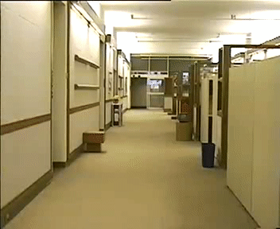
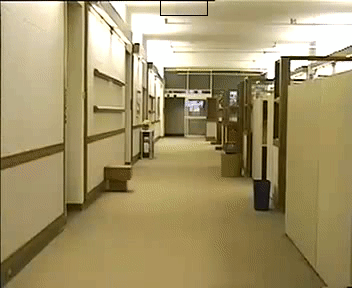

## Install YUV viewer
I installed the [pyuv-player](https://github.com/gbaruffa/pyuv-player). While there are several choices, I found this one easiest to install. 

## Compile 
```bash
make clean
make install
```

## demo
* Download your choice of [raw yuv sequence](http://trace.eas.asu.edu/yuv/)
* Note the resolution (352x288 px), color space (yuv) and subsampling (4:2:0). This information is necessary for both the encoder and viewing the raw file.
* View the input file with pyuv-player. You may need to set the format (`File->Format`) based on the above information to view the sequency correctly.
* Place the input file in a convenient location (`JM/input`)
* Modify the following variables in `JM/bin/encoder.cfg` as needed:
  * InputFIle
  * FramesToBeEncoded
  * SourceWidth
  * SourceHeight
  * OutputWidth
  * OutputHeight
  * ReconFile
  * OutputFIle
  * StatsFile
* Execute the encoder as follows. This will take a long time depending on the number of frames being encoded (300 frames took approx 30 mins).
```bash
cd JM/bin
./lencod.exe
```
* The output of the above step generates another raw video sequence (i.e, no containers like .avi or .mkv) encoded based on H.264 standard. This file has the motion vector information embeded in it.
* To run the decoder, set the configuration variables - `InputFile, OutputFile`, in `JM/bin/decoder.cfg`.
* Run the decoder like so:
```bash
cd JM/bin
./ldecod.exe
```
* The output file contains the same input video sequence but in each frame, a box is drawn to identify the motion of the subject.
 

## Documentation
Refer to the report for a detailed description of the project. Refer to the presentation to see the changes made to the open source JM decoder for our implementation.

## Future Work
* Only verified the latest software working on Ubuntu 17.10. Need to port it to work on other OSes.
* Need to separate JM code from the changes we made to make it easier to update JM whenever needed. Also keeps the changes clear.

## Credits
Project by: Yan Meng, Sriharsha Madala.

3. Executing the source code is same as before. Use lencod.exe to encode any .yuv file. Make sure to configure the encoder using  encoder.cfg
4. If you have a h264 encoded bit stream, run ldecod.exe. configuration is done using decoder.cfg.
